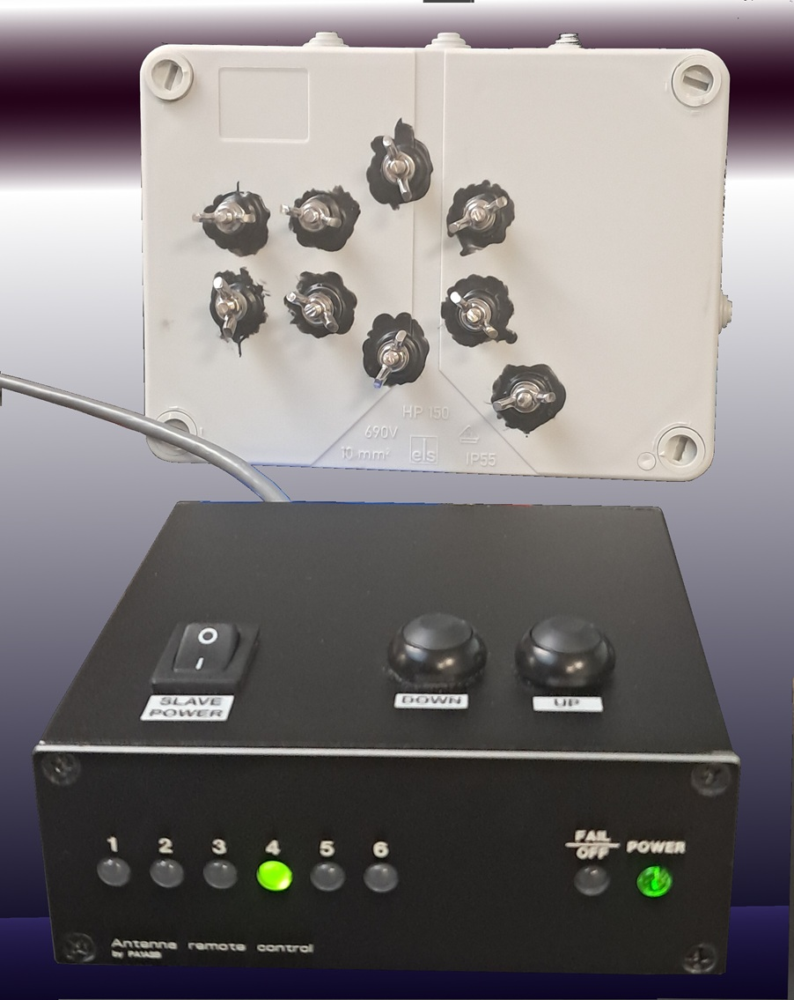
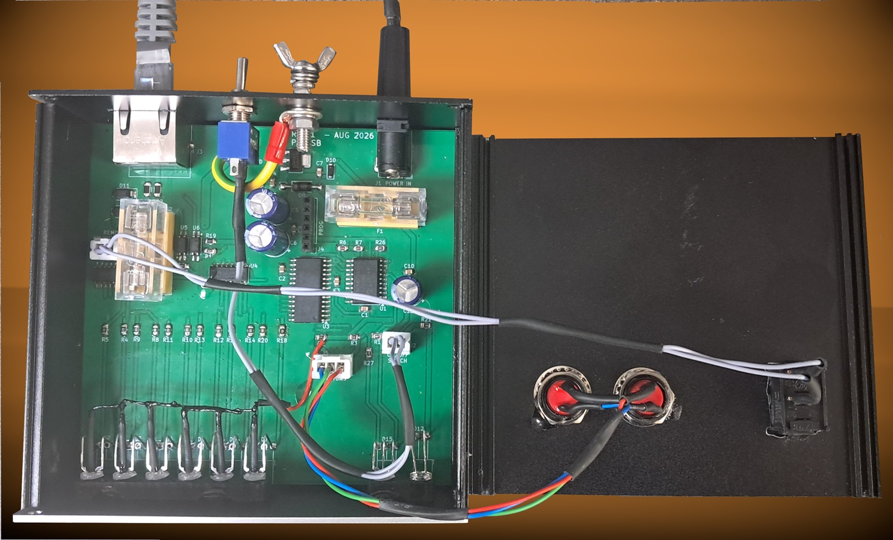
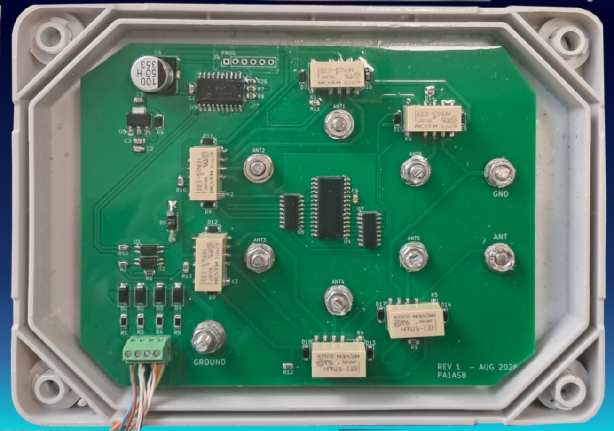
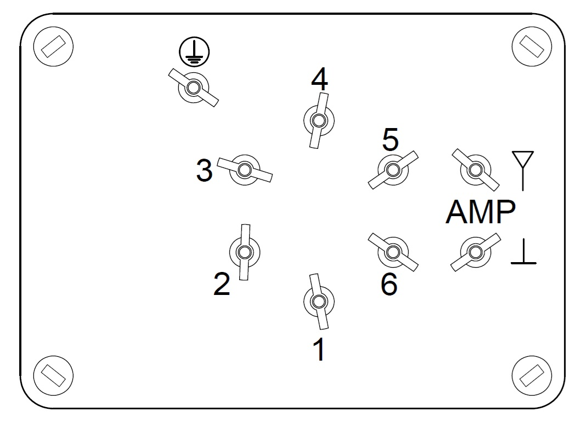
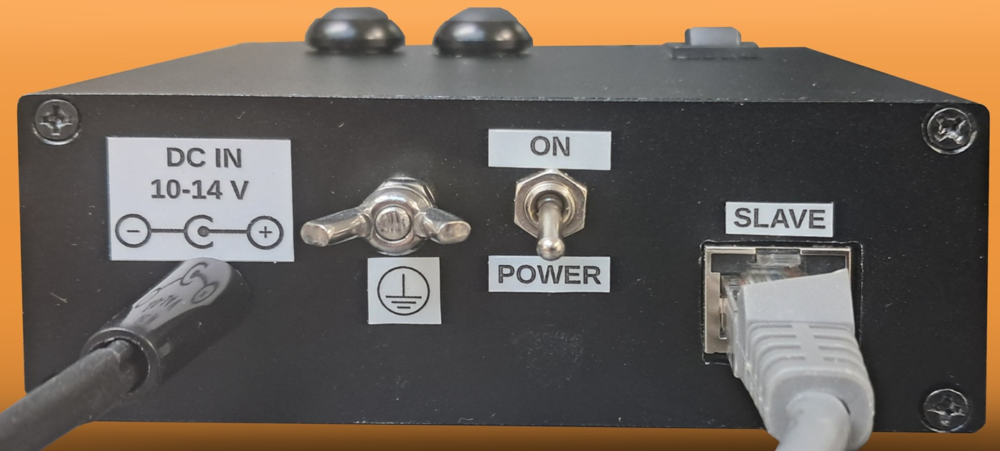

# BAS6 - Remote controlled receive antenna switch for 6 beverage antennas

This project describes a 6-way receive antenna switch I built for a fellow radio amateur that allows to select one of six beverage wire antennas remotely and producing as little as possible noise around the connection to his receive amplifier. Using bi-stable relays makes it possible to completely disconnect power to the relays once an antenna has been selected. Switching is controlled by a small circuit, built in a tiny aluminium extrusion desktop enclosure, using two UP/DOWN tactile switches. Bi-colour LED’s on the from panel indicate the currently connected antenna and, when using the selection buttons, the next antenna to be switched on. Connection between the control station in the shack and the actual relay box requires 4 wires; using cheap UTP/FTP is therefore possible. The circuit should work over distances in excess of 200 meters as communication between the stations is done through two current loops (receive and transmit).

Control unit and relay box communicate “digitally” by sending some pulses to and fro, the number of which determine what the relaybox should actually do. After executing a command, the circuit measures which relay is actually switched on / off and reports this back to the control unit again as a series of pulses. If for whatever reason the reported switch state differs from what has been commanded, an error is indicated so that  the user knows there’s something wrong. This will prevent unnecessary walks from the shack to the antenna connections: what is  indicated on the control unit is the actual state.

The antennas are connected to the switch on the PVC junction box. I have made quite some effort in making the box and connections that are located outside of the box as watertight as possible but I guess that it is still advisable to make some additional protection to prevent direct exposure to the environment.

You can find the schematics of both units both as PDF and KiCAD v10 files as well as the C sources. I have also included BOM files for the PCB’s. There’s some additional hardware required such as stainless steel hardware for the antenna connections and switches to control the relays; these are not mentioned in these files. I have built the software in MPLAB IDE with the XC8 1.33 compiler. The C source should also compile in the newer MPLAB X IDE with the newer compiler versions but I believe that there are some minor syntax changes between the old and new versions which obviously need to be resolved. Google will be your friend for that, I guess.

